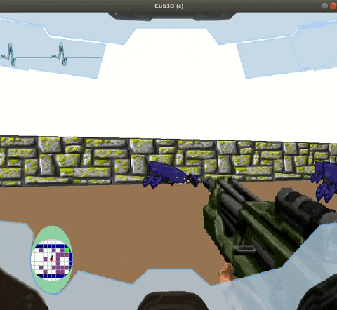

# Projet Cub3D

Cub3D is an individual school project at 42 Paris campus. It is Video game project inspired by Wolfenstein 3D using Minilibx library and ray-casting technology.

  

## Installation

``make all
``

``./cub3D /maps/world_bonus.cub
``

## Game Commands

* WASD to move
* Left/Right directional keys to rotate camera
* Right Shift to fire
* LEFT Shift to sprint
* F key for interactions
* Q/E keys o lose or to gain life
* ESC to quit

## BONUS

* Collision with walls
* HUD
* Fog war on walls
* electrocardiogram (health bar)
* Medikit
* Collision with sprites
* Win / Loose HP
* Game Over screen
* Openable doors
* Secret Door
* Animated gun
* Gun and enemy
* Sprint
* Multi-threading raycast
* Sensor / Minimap

#### This project works only under a Linux OS, to make it work under a MACOS please install the associated Minilibx.